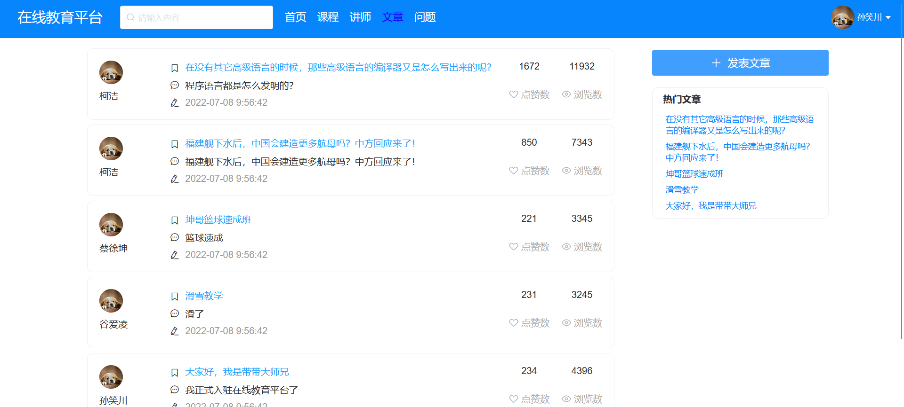
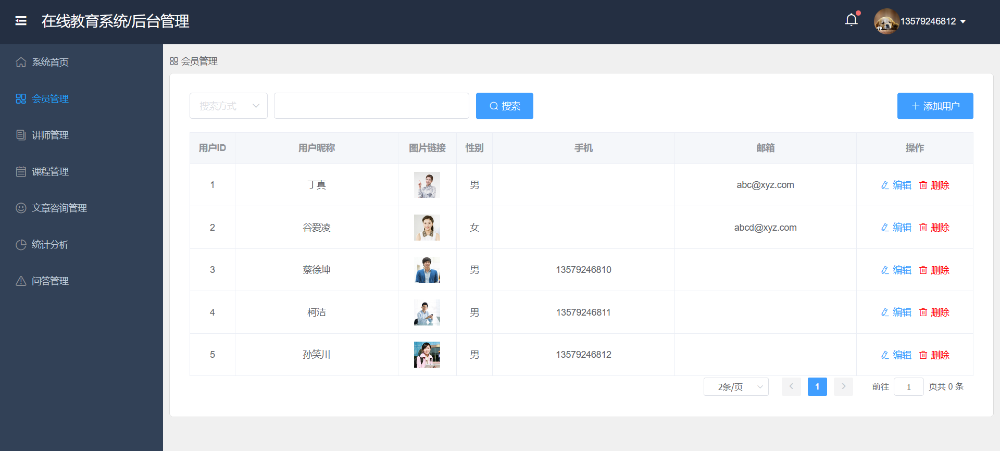

# OnlineLearning
## 在线教育系统  
第12组项目，前后端分离的在线教育系统。
- 前端使用Vue3+Element-Plus
- 后端使用Springboot+MybatisPlus+Mysql
## 目录结构
```ini
├── vue                        # 前端项目源代码(vue)
│   └── ...       
├── src                        # 后端项目源代码
│   └── ...                
├── sql                        # 数据库生成脚本(mysql5.7)
│   └── ...                
├── .eslintrc.js               # eslint 配置项
├── .gitignore                 # Git忽略文件配置
├── package.json               # 项目信息
└── README.md                  # readme
...
```
## 截图



## 参考
***感谢开源！***    
[vue-manage-system](https://github.com/lin-xin/vue-manage-system)  
[blog-vue-springboot](https://github.com/shimh-develop/blog-vue-springboot)  
[Swiper3D](https://github.com/Abner105/Swiper3D)